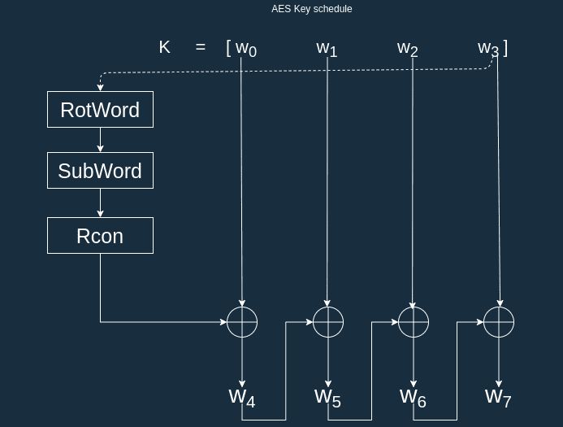

# AES128 RTL implementation

Implementation of the AES128 encryption/decryption algorithm into synthesizable RTL.
The encryption/decryption takes place over multiple cycles inline with the aes's rounds, for
aes128 it take 12 cycles for the module to produce an output.


## RTL

This synthesizable implementation of AES128 includes two separate designs : one for encryption and another for decryption.
Our implementation breaks down the more difficult rounds of the AES algorithm into there own module, simpler rounds are
performed in the top level. 

Modules :
|    | Encryption      | Decryption |
| -- | --------------- | ----------- |
|top | aes       | iaes    |
|sbox| sbox  | isbox      |
|mix columns | mixw  | imixw      |
|key scheduling| ks  | iks  |


### Top 

The top level module contains the main control logic for the aes algorithm.
This module includes :

- FSM keeping track of the aes round we are currently

- flops for the data and key

- shift row round 


#### Encryption interface

```
module aes(
	input clk,
	input nreset,
	
	input          data_v_i, // input valid
	input [127:0]  data_i,   // message to encode
	input [127:0]  key_i,    // key
	output         res_v_o,  // result valid
	output [127:0] res_o     // result
	);
``` 

#### Decryption interface
```
module iaes(
	input clk,
	input nreset,
	 
	input          data_v_i, // input valid
	input  [127:0] data_i,	 // message to decode
	input  [127:0] key_i,    // key ( encoded version )
	output         res_v_o,  // result valid
	output [127:0] res_o     // result
	);
```

### Sbox

Sbox module output the corresponding byte according to the Rijndael S-box substitution.

We do not store the sbox lookup table in memory but rater calculate it on the fly.
 
#### Encryption interface
```
module sbox(
    input  [7:0] data_i,
    output [7:0] data_o
    );
```
#### Decryption interface
```
module isbox(
    input  [7:0] data_i,
    output [7:0] data_o
    );
```

### Mix Columns

This module takes in 4 bytes and treats them as a 4 term polynomial and multiplies them with a predetermined 4x4 matrix.
These operations are done in a Galois field, as such the definition of operations such as "multiplication" and "addition"
is different.

Encryption :


Decryption :


#### Encryption interface
```
 module mixw(
	input  [31:0] w_i,
	output [31:0] mixw_o
	);
```

#### Decryption interface
```
module imixw(
	input  [31:0] w_i,
	output [31:0] mixw_o
	);
```

### Key scheduling 

This module derives the new 4 byte key and 1 byte round constant (rcon) for the current aes round by taking in the previous round key and rcon. 
Internally this module also calls on the sbox module during operations on the higher order byte.

encryption : 



#### Encryption interface
```
module ks(
	input  wire [127:0] key_i,
	input  wire [7:0]   key_rcon_i,
	output wire [127:0] key_next_o,
	output wire [7:0]   key_rcon_o
	);
```
#### Decryption interface
```
module iks(
	input  wire [127:0] key_i,
	input  wire [7:0]   key_rcon_i,
	output wire [127:0] key_next_o,
	output wire [7:0]   key_rcon_o
	);
```

## Test bench

This project includes a dedicated test bench for all major module. 
The top level test benches are the most complete and the main tool for testing this design and comparing it's output to our model.
Other test benches are smaller and do not support external test vectors, they are used for debugging the
individual modules.

Test bench files :
|    | Encryption      | Decryption |
| -- | --------------- | ----------- |
|top | top\_test.vhd   | itop\_test.vhd  |
|sbox| sbox\_test.vhd  | isbox\_test.vhd      |
|mix columns | mixw\_test.vhd  | imixw\_test.vhd      |
|key scheduling| ks\_test.vhd  | iks\_test.vhd  |


### Top 

This implementation's correctness is tested by comparing, for a given input, the output produced
by the rtl and a golden model implemented in C. 

Located in the `tv/` folder an implementation of aes in C produced a number of random data and keys and 
computes the encoded output data and last round keys. Each of these values is written to file using ascii
in a binary representation from msb to lsb, and using one line per vector. 

Output files :

- `aes_enc_data_i.txt` input data for encryption

- `aes_enc_key_i.txt` input for encryption

- `aes_enc_data_o.txt` encrypted data

- `aes_enc_key_o.txt` key at the last round of the encryption

By default these files should be populated with 10 unique test vectors so
there is no requirement for users to run the model.

#### Generating new test vectors

To generate new test vectors we first need to compile our C AES code and run the resulting program.

```
make aes
./aes
```

( optional ) To build with debug :
```
make aes debug=1
```

##### Configuration 

Users can configure the generation of test vector using the following macro's "

- `TEST_NUM`  number of test vectors to be generated, located in `main.c`, default value is `10`

- `FILE_STR` array of file names to which the test vectors are written, located in `file.h`, default value is `{"aes_enc_data_i.txt","aes_enc_key_i.txt","aes_enc_res_o.txt", "aes_enc_key_o.txt"}`

##### aes.h

This aes implementation was originally written by Dani Huertas and Nikita Cartes and
can be found at [https://github.com/dhuertas/AES](https://github.com/dhuertas/AES) 
